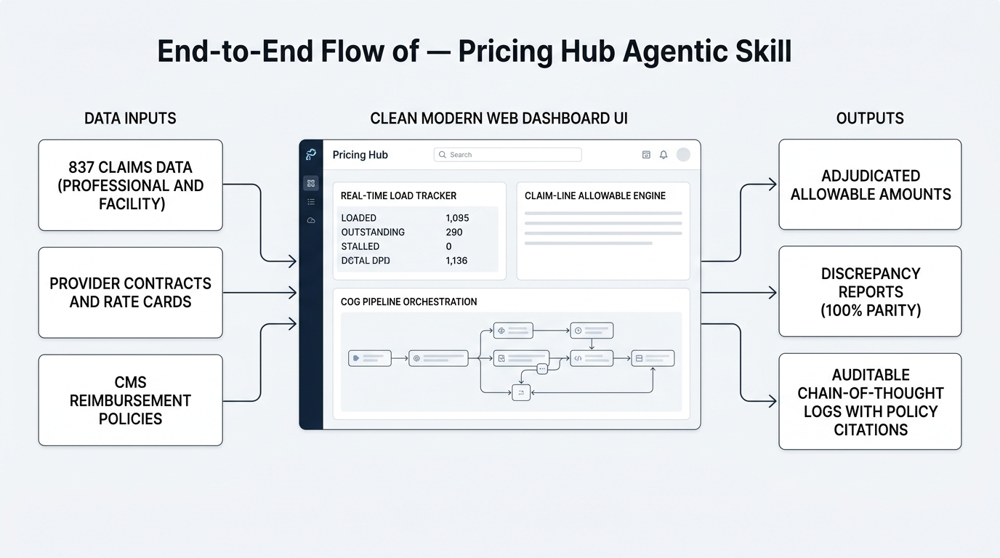

# Pricing Hub Agentic Skill (`pricing-hub-skill`)

An autonomous agentic skill designed to resolve the core operational bottlenecks of the Pricing Hub: accelerating contract ingestion, automating allowable amount verification, providing real-time pipeline visibility across **Loaded**, **Outstanding**, and **Stalled** loads, and securing migration SLAs.



---

## Key Capabilities

1. **Contract and Policy Ingestion Subsystem**:
   - Ingests provider contracts, rate cards, and CMS / commercial reimbursement policies.
   - Extracts fee schedules, DRG relative weights, % of billed charges, per diem rates, and contractual clauses.
   - Standardizes parameters into normalized data models for the claim pricing engine.

2. **Automated Allowable Amount Verification**:
   - Evaluates Professional (837P) and Facility (837I) claims across **Commercial**, **Medicare**, and **Medicaid** lines of business.
   - Accurately computes allowable amounts using Fee Schedules, DRG Case Rates, % of Charges, MPPR 50% surgical reductions, and modifier splits (-26, -TC).
   - Generates an auditable **Chain of Thought** citing exact contract sections and policy paragraphs.
   - Detects discrepancies (allowable deltas, unexpected denials, disposition mismatches).

3. **Real-Time Pricing Load Tracker & Bottleneck Pinpointer**:
   - Categorizes pricing loads into `LOADED`, `OUTSTANDING`, and `STALLED`.
   - Automatically pinpoints bottleneck root causes (`MISSING_FEE_SCHEDULE`, `PROVIDER_NPI_UNMAPPED`, `RATE_CARD_DATE_OVERLAP`, `VALIDATION_VARIANCE_BREACH`, `DEPENDENCY_TIMEOUT`).
   - Computes dynamic completion ETAs and triggers real-time alerts upon SLA breach risks.

4. **Synthetic Test Data & Validation Documentation Package**:
   - **100-Claim Golden Dataset**: Fully curated across Commercial, Medicare Advantage, and Medicaid for both Professional and Facility claims with known ground truth.
   - **Rule-to-Policy Mapping Matrix**: Cross-references every line-item edit and CARC code to its governing contract clause and policy paragraph.
   - **Claim-Line Disposition Set**: Test cases for `PAID`, `DENIED` (CO-16, CO-97, CO-45, CO-29), and `SUSPENDED` (> $100k review).
   - **Inter-Cog Integration Fixtures**: Simulates end-to-end handshakes across `Member Pick Cog` -> `Benefit Accumulator Cog` -> `Contract Pick Cog` -> `Pricing Engine Cog`.

5. **Strict Scope Enforcement Gate**:
   - Supported: Commercial, Medicare, Medicaid; Professional (837P) and Facility (837I).
   - Excluded: Immediately rejects Dental (837D), Vision, and Pharmacy (NCPDP) with `REJECT_UNSUPPORTED_LOB_EXCLUSION`.

---

## How to Use This Skill: A Non-Technical Guide

This skill serves as an automated pricing analyst and operations coordinator for health insurance claims. In standard healthcare operations, updating provider contracts, verifying payment rules, and tracking system migrations requires significant manual cross-referencing between legal contracts, clinical policies, and fee tables. When a rate or provider identifier is missing, batches stall in queue, delaying provider reimbursements and jeopardizing migration deadlines.

This skill automates these workflows through three core operational functions:

### 1. Ingesting Contracts and Policies Automatically
Rather than requiring analysts to manually transcribe procedure codes and dollar amounts into billing databases, the skill reads contract agreements (PDFs and structured rate cards) and reimbursement policy guidelines directly.

- **What happens**: The system parses the document, verifies that effective date ranges are continuous, checks that no required rates are missing, and indexes every procedure code.
- **Example**: When an operations team receives an updated commercial provider agreement, the file is placed into the contracts directory and the ingestion process is triggered. The skill extracts all office visit and surgical rates, confirms date validity, and loads them into memory for claims pricing.

### 2. Auditing and Verifying Claim Calculations
Before a health plan pays live claims or migrates to a new pricing platform, operations leadership must verify that claims pay the exact contracted amount. The skill adjudicates test claims against ground-truth benchmarks and flags any variance.

- **What happens**: Each service line is priced according to contracted fee schedules, inpatient hospital case rates (DRGs), or percentage-of-charge rules. When multiple surgical procedures take place during the same session, the skill automatically discounts secondary procedures by 50 percent according to standard payment reduction guidelines. An auditable trail is produced citing the governing contract section and policy paragraph.
- **Example**: A physician submits a bill for $3,500 for a knee arthroscopy (CPT code 29881) alongside an office visit (CPT code 99214). The skill verifies that the office visit carries modifier 25 (allowing separate payment at $165.00), applies the contracted fee of $1,250.00 for the surgical procedure, and confirms a zero-dollar discrepancy against expected outcomes.

### 3. Pinpointing Operational Bottlenecks in Real Time
During system migrations or high-volume processing cycles, pricing loads progress through three defined stages:
- **Loaded**: Ingestion and baseline verification are complete; the contract is ready for live adjudication.
- **Outstanding**: The load is actively processing within expected turnaround times.
- **Stalled**: Processing is halted due to a specific bottleneck requiring intervention.

Instead of issuing generic failure messages, the skill identifies the precise root cause and provides actionable next steps:
- **Example**: If a Medicaid contract load is marked as Stalled, the system indicates:
  - Bottleneck Reason: Provider NPIs associated with the contract are not registered in the credentialing registry.
  - Remediation: The provider network team must map the NPI to an active billing entity before processing can resume.
- Operational managers can monitor all active loads, completion percentages, and projected completion dates using either the command line or the browser dashboard.

---

## Core Skill Tasks & Agent Harness Prompt Examples

An autonomous agent harness can invoke this skill across 11 core operational tasks. Below is each task's description, the local input file in `data/`, a sample prompt to give the agent, and the underlying command executed.

### Task 1: Provider Contract Ingestion
- **Description**: Ingests provider agreements in PDF or JSON format to extract contracted fee schedules, inpatient DRG base rates, percent of charges, and contractual terms.
- **Input File**: `data/contracts/commercial_provider_contract.pdf` (or `data/contracts/commercial_provider_contract.json`)
- **Prompt Example**:
  ```text
  Ingest the provider contract located at data/contracts/commercial_provider_contract.pdf. Extract all contracted fee schedule amounts, DRG case rate base amounts, and contractual clauses (including timely filing limits and MPPR rules). Validate that there are no negative values or overlapping effective dates, and output a structured ingestion summary.
  ```
- **Action**: `python3 scripts/run_ingestion.py --contracts-dir data/contracts`

### Task 2: CMS & Commercial Reimbursement Policy Ingestion
- **Description**: Ingests CMS National and Local Coverage Determinations (NCD/LCD) and commercial reimbursement guidelines in PDF or JSON format to extract clinical billing rules.
- **Input File**: `data/policies/CMS_NCD_220_4_Cardiac_Diagnostic_Ultrasound.pdf` (or `data/policies/commercial_reimbursement_policies.json`)
- **Prompt Example**:
  ```text
  Ingest the CMS reimbursement policy at data/policies/CMS_NCD_220_4_Cardiac_Diagnostic_Ultrasound.pdf and commercial guidelines at data/policies/commercial_reimbursement_policies.json. Extract clinical billing rules, applicable CPT procedure codes, modifier requirements, and paragraph citations for claim adjudication.
  ```
- **Action**: `python3 scripts/run_ingestion.py --policies-dir data/policies`

### Task 3: Single Claim .X12 EDI Ingestion & Parsing
- **Description**: Ingests individual ANSI ASC X12 EDI files (837P, 837I, 837D) directly, transforming raw loop segments into normalized, structured claim data.
- **Input File**: `data/claims_x12/sample_837p_professional.x12`
- **Prompt Example**:
  ```text
  Ingest and parse the raw EDI claim in data/claims_x12/sample_837p_professional.x12. Parse the X12 loop segments (ST 837, NM1*41 billing provider, NM1*IL subscriber, CLM claim information, and SV1 service lines) into a normalized JSON claim model.
  ```
- **Action**: `python3 scripts/run_verification.py --claims-file data/claims_x12/sample_837p_professional.x12`

### Task 4: Scope Enforcement Gate Verification
- **Description**: Automatically intercepts out-of-scope claims (Dental 837D, Pharmacy NCPDP, Vision) before they reach the pricing engine, returning standardized rejection codes.
- **Input File**: `data/claims_x12/sample_837d_dental_excluded.x12`
- **Prompt Example**:
  ```text
  Evaluate the claim file in data/claims_x12/sample_837d_dental_excluded.x12 against the Pricing Hub scope enforcement gate. If the claim type is out-of-scope (such as Dental, Vision, or Pharmacy), intercept it and return the formal rejection reason code (REJECT_UNSUPPORTED_LOB_EXCLUSION) with CARC CO-16.
  ```
- **Action**: `python3 scripts/run_verification.py --claims-file data/claims_x12/sample_837d_dental_excluded.x12`

### Task 5: Multi-Methodology Claim Pricing
- **Description**: Calculates exact claim-line allowable amounts using Standard Fee Schedules, Inpatient DRG Case Rates with Outlier factors, Percent of Charges, and MPPR Surgical Reductions.
- **Input File**: `data/claims_x12/sample_837i_facility.x12`
- **Prompt Example**:
  ```text
  Price the inpatient facility claim in data/claims_x12/sample_837i_facility.x12 using the contracted hospital agreement in data/contracts/commercial_provider_contract.json. Match Inpatient DRG 470, multiply the base rate by the CMS relative weight, check whether total billed charges exceed the $45,000 outlier threshold, and output the final allowable amount.
  ```
- **Action**: `python3 scripts/run_verification.py --claims-file data/claims_x12/sample_837i_facility.x12`

### Task 6: Clinical Modifier & Payment Edit Adjudication
- **Description**: Enforces modifier rules including 50% surgical discounts (-51), professional/technical component splits (-26 / -TC), distinct E/M visits (-25), incidental bundling denials (CO-97), and timely filing limits (CO-29).
- **Input File**: `data/claim_line_dispositions/disposition_test_cases.json`
- **Prompt Example**:
  ```text
  Adjudicate the test cases in data/claim_line_dispositions/disposition_test_cases.json to verify clinical payment edits. Confirm that modifier -51 applies a 50% MPPR reduction on secondary surgical lines, modifier 25 permits distinct E/M evaluation, CPT 99000 denies as incidental bundling (CO-97), and untimely submissions deny with CO-29.
  ```
- **Action**: `pytest tests/test_pricing_engine.py -v`

### Task 7: Batch Golden Dataset Parity Verification
- **Description**: Audits high-volume batches (such as the 100-claim Golden Dataset) against ground-truth benchmarks within a 0.01% tolerance threshold.
- **Input File**: `data/golden_dataset/golden_claims_all.json`
- **Prompt Example**:
  ```text
  Run batch allowable verification across the 100-claim golden dataset in data/golden_dataset/golden_claims_all.json against active contracts in data/contracts/ and policies in data/policies/. Verify that concordance accuracy achieves 100.0% parity against expected ground truth within the 0.01% tolerance threshold.
  ```
- **Action**: `python3 scripts/run_verification.py --claims-file data/golden_dataset/golden_claims_all.json`

### Task 8: Auditable Chain-of-Thought Generation
- **Description**: Produces a step-by-step pricing explanation for every claim line, citing the exact contract clauses and policy paragraphs that governed the payment.
- **Input File**: `data/mapping_matrix/rule_to_policy_matrix.json` (with `data/golden_dataset/golden_claims_professional.json`)
- **Prompt Example**:
  ```text
  Adjudicate the professional claims in data/golden_dataset/golden_claims_professional.json and generate an auditable Chain-of-Thought report using the rule-to-policy mapping matrix at data/mapping_matrix/rule_to_policy_matrix.json. Include the exact contract clause, policy identifier, and paragraph citations for every calculated allowable amount.
  ```
- **Action**: `python3 scripts/run_verification.py --claims-file data/golden_dataset/golden_claims_professional.json --sample-audit`

### Task 9: Real-Time Load & Bottleneck Monitoring
- **Description**: Tracks enterprise migration loads across LOADED, OUTSTANDING, and STALLED categories, pinpointing root causes like unmapped provider NPIs or date overlaps and issuing remediation alerts.
- **Input File**: `configs/pricing_hub_config.yaml` (with `data/benefits/member_benefits_accumulators.json`)
- **Prompt Example**:
  ```text
  Inspect all in-flight pricing loads across Commercial, Medicare, and Medicaid lines of business using thresholds defined in configs/pricing_hub_config.yaml. Flag any loads in a STALLED state, identify the bottleneck root cause (such as unmapped provider NPIs or rate card date overlaps), and generate critical remediation instructions.
  ```
- **Action**: `python3 scripts/monitor_loads.py`

### Task 10: Multi-Cog Pipeline Handshake Simulation
- **Description**: Simulates and validates enterprise inter-cog payload handshakes across Member Eligibility, Benefit Accumulation, Contract Matching, and Claim Pricing.
- **Input File**: `data/integration_tests/cog_integration_test_file.csv`
- **Prompt Example**:
  ```text
  Simulate an end-to-end multi-cog claim processing pipeline using the integration test records in data/integration_tests/cog_integration_test_file.csv. Validate the data payload handshakes between MemberPickCog, BenefitAccumulatorCog, ContractPickCog, and PricingEngineCog.
  ```
- **Action**: `pytest tests/test_cog_integration.py -v`

### Task 11: Interactive Process Inspector Dashboard
- **Description**: Provides a unified web interface with Light and Dark modes to inspect raw X12 files, test ad-hoc claim calculations, verify batch parity, and remediate pipeline bottlenecks.
- **Input File**: `src/ui/dashboard.html` (renders data from `data/claims_x12/` and `data/contracts/`)
- **Prompt Example**:
  ```text
  Launch the interactive process inspector dashboard at src/ui/dashboard.html. Allow the user to inspect raw X12 EDI claims, view real-time JSON conversions, test interactive claim pricing scenarios, and simulate bottleneck remediation.
  ```
- **Action**: `python3 scripts/launch_ui.py`

### Programmatic Python Invocation Example
Agents executing Python code directly can invoke skill components programmatically:

```python
from src.ingestion.contract_parser import ContractParser
from src.ingestion.policy_parser import PolicyParser
from src.ingestion.x12_claim_loader import X12ClaimLoader
from src.pricing_engine.pricing_router import PricingRouter

# 1. Ingest rate cards and policy guidelines
contract_parser = ContractParser()
contract_parser.load_directory("data/contracts")

policy_parser = PolicyParser()
policy_parser.load_directory("data/policies")

# 2. Ingest claims (interoperable with raw X12 and parsed loops)
claim_loader = X12ClaimLoader()
claims, rejected, _ = claim_loader.load_claims_file("data/claims_x12/sample_837p_professional.x12")

# 3. Adjudicate claim and generate auditable pricing
router = PricingRouter(contract_parser, policy_parser)
priced_claim = router.price_claim(claims[0])

print(f"Claim ID: {priced_claim.claim_id}")
print(f"Total Billed: ${priced_claim.total_billed_amount:,.2f}")
print(f"Total Allowable: ${priced_claim.total_allowable_amount:,.2f}")
print(f"Disposition: {priced_claim.overall_disposition.value}")
```

---

## Directory Structure

```text
pricing-hub-skill/
├── LICENSE                           # Apache License, Version 2.0
├── SKILL.md                          # Main agentic skill instruction runbook
├── README.md                         # System documentation and developer guide
├── assets/                           # Document assets and workflow diagrams
│   └── pricing_hub_workflow.png      # Architectural workflow diagram
├── configs/
│   └── pricing_hub_config.yaml       # LOB boundaries, SLA thresholds, alert settings
├── data/
│   ├── contracts/                    # Commercial, Medicare, and Medicaid rate cards (JSON & PDF)
│   │   ├── commercial_provider_contract.json / .pdf
│   │   ├── medicare_advantage_contract.json / .pdf
│   │   └── medicaid_managed_care_contract.json / .pdf
│   ├── policies/                     # CMS LCD/NCD & commercial reimbursement policies (JSON & PDF)
│   │   ├── CMS_NCD_220_4_Cardiac_Diagnostic_Ultrasound.pdf
│   │   ├── CMS_LCD_L33587_Spinal_Injections_Interventions.pdf
│   │   ├── PAYER_RP_042_Multiple_Procedure_Payment_Reduction.pdf
│   │   ├── PAYER_RP_109_Same_Day_EM_Modifier_25.pdf
│   │   ├── PAYER_RP_018_Incidental_Bundled_Services.pdf
│   │   └── PAYER_RP_003_Timely_Filing_Limit.pdf
│   ├── benefits/                     # Member SBC profiles and accumulators (JSON & PDF)
│   │   ├── member_benefits_accumulators.json
│   │   └── SBC_Commercial_Silver_PPO_2000.pdf / SBC_Medicare... / SBC_Medicaid...
│   ├── claims_x12/                   # Raw X12 EDI files & parsed loop structures
│   │   ├── sample_837p_professional.x12
│   │   ├── sample_837i_facility.x12
│   │   ├── sample_837d_dental_excluded.x12
│   │   └── sample_parsed_x12_loops.json
│   ├── golden_dataset/               # 100-Claim Golden Dataset with ground truth
│   │   ├── golden_dataset_manifest.json
│   │   ├── golden_claims_all.json
│   │   ├── golden_claims_professional.json
│   │   └── golden_claims_facility.json
│   ├── mapping_matrix/               # Rule-to-Policy cross-reference matrix (CSV & JSON)
│   │   ├── rule_to_policy_matrix.csv
│   │   └── rule_to_policy_matrix.json
│   ├── claim_line_dispositions/      # Disposition test cases (Paid, Denied, Suspended)
│   │   └── disposition_test_cases.json
│   └── integration_tests/            # Cog interaction test fixtures (JSON & CSV)
│       ├── cog_integration_matrix.json
│       ├── cog_integration_test_file.csv
│       └── cog_integration_test_file.json
├── src/
│   ├── models/                       # Domain models (Claim, Contract, Policy, Pricing, Monitoring)
│   ├── ingestion/                    # Parsers for contracts (JSON/PDF), policies, and X12 claims
│   ├── pricing_engine/               # Fee schedule, DRG, % of charges, and MPPR calculators
│   ├── verification/                 # Discrepancy detector and Chain-of-Thought audit generator
│   ├── monitoring/                   # Load tracker, bottleneck analyzer, and alert dispatcher
│   ├── cogs/                         # Inter-cog pipeline simulators
│   └── ui/                           # Management and process inspector UI
│       └── dashboard.html            # Interactive process inspector and dashboard with Light/Dark mode
├── scripts/
│   ├── run_ingestion.py              # Ingests contracts and policies CLI
│   ├── run_verification.py           # Runs allowable validation on claims CLI
│   ├── monitor_loads.py              # Real-time pipeline monitoring dashboard CLI
│   ├── launch_ui.py                  # Local HTTP server runner for process inspector dashboard
│   ├── generate_fixtures.py          # Synthetic dataset and golden claim generator
│   └── generate_synthetic_pdfs.py    # Generates contract, policy, and SBC PDFs + X12 EDI samples
└── tests/                            # 23-test pytest suite
    ├── test_ingestion.py
    ├── test_pricing_engine.py
    ├── test_verification.py
    ├── test_monitoring.py
    ├── test_golden_dataset.py
    └── test_cog_integration.py
```

---

## Interactive Process Inspector & Dashboard UI

The skill includes an interactive, zero-dependency visual interface designed for direct rendering in iframe environments or standalone web browsers.

### Automatic Post-Task Dashboard Generation:
Whenever any skill task finishes (contract ingestion, single claim .x12 parsing, golden dataset parity verification, or pipeline migration monitoring), the skill automatically creates and updates `src/ui/dashboard.html` with the run's data, providing an immediate visual inspection surface.
- **Light and Dark Mode Toggle**: Persistent theme switcher powered by CSS custom properties, allowing users to alternate between clean enterprise light and dark themes.
- **1. Ingestion Inspector**: Search and inspect active fee schedules, DRG hospital weights, and CMS LCD/NCD coverage policies.
- **2. Interactive Adjudicator**: Real-time claims pricing calculator allowing users to test CPT codes, surgical modifier reductions (-51), split diagnostic components (-26 / -TC), bundling edits, and timely filing rules with immediate allowable calculations.
- **3. Verification Parity Explorer**: Interactive browser for the 100-claim Golden Dataset with filtering by line of business, concordance validation, and expandable step-by-step Chain-of-Thought audit logs.
- **4. Load Pipeline and Bottleneck Resolver**: Visualizes load progression across Loaded, Outstanding, and Stalled states, with an interactive "Resolve and Re-Ingest" simulator to demonstrate unblocking stalled pipelines.
- **5. Multi-Cog Flow**: Interactive visualizer tracing payloads across Member, Benefit, Contract, and Pricing engine cogs.
- **6. X12 EDI and JSON Transformer**: Live side-by-side inspection workbench displaying raw ANSI ASC X12 EDI streams (.x12 / .edi) alongside normalized structured JSON domain models, complete with real-time scope gate verification (in-scope vs excluded dental/vision/pharmacy) and allowable price adjudication.

### Accessing the Interface:
- **Direct File Access**: Open `src/ui/dashboard.html` directly in any web browser.
- **Local HTTP Runner**: Run `python3 scripts/launch_ui.py` to serve the interface locally on port 8080.

---

## Quickstart & CLI Commands

### 1. Ingest Contracts and Policies
```bash
python3 scripts/run_ingestion.py
```

### 2. Run Automated Allowable Verification (100 Golden Claims)
```bash
python3 scripts/run_verification.py
```
*Expected Result: 100/100 claims passed (100.0% concordance), zero discrepancies.*

### 3. Launch Real-Time Pricing Load Monitor
```bash
python3 scripts/monitor_loads.py
```
*Displays pipeline status (`LOADED`, `OUTSTANDING`, `STALLED`), throughput, ETAs, bottleneck diagnostics, and alert dispatches.*

### 4. Run Pytest Test Suite
```bash
pytest -v
```
*23/23 tests passing in < 0.35s.*

---

## License

This project is licensed under the Apache License, Version 2.0. See the [LICENSE](LICENSE) file for the full license text.

